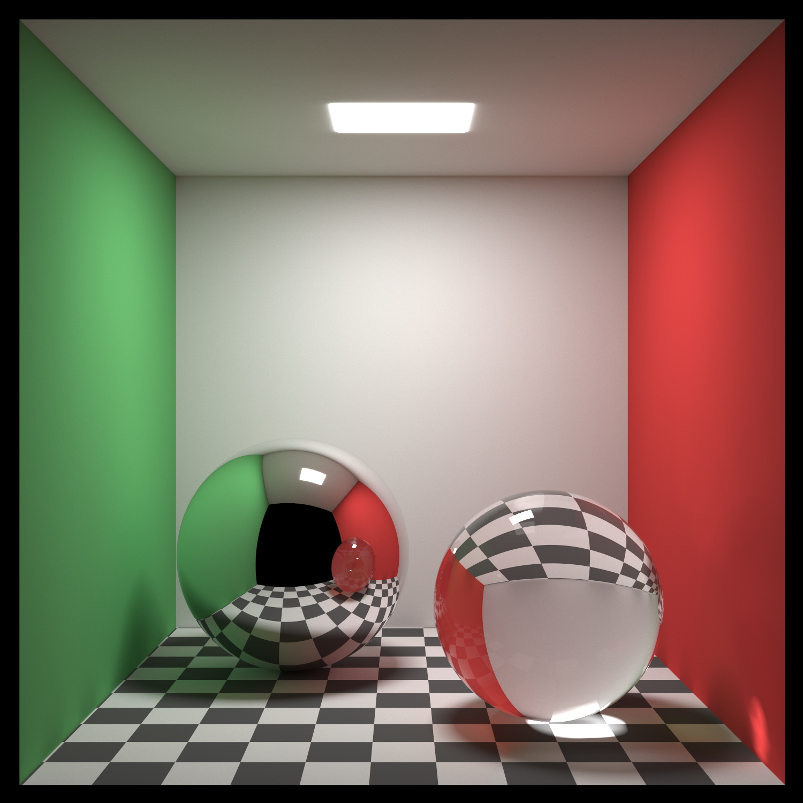
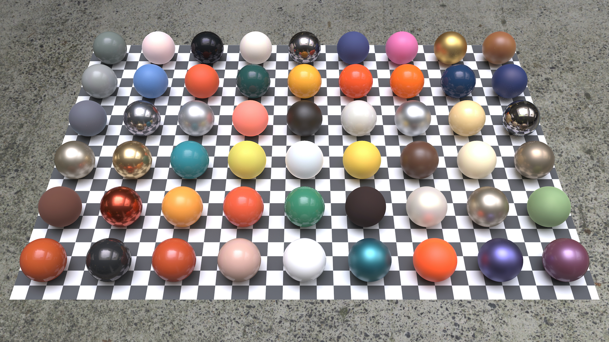
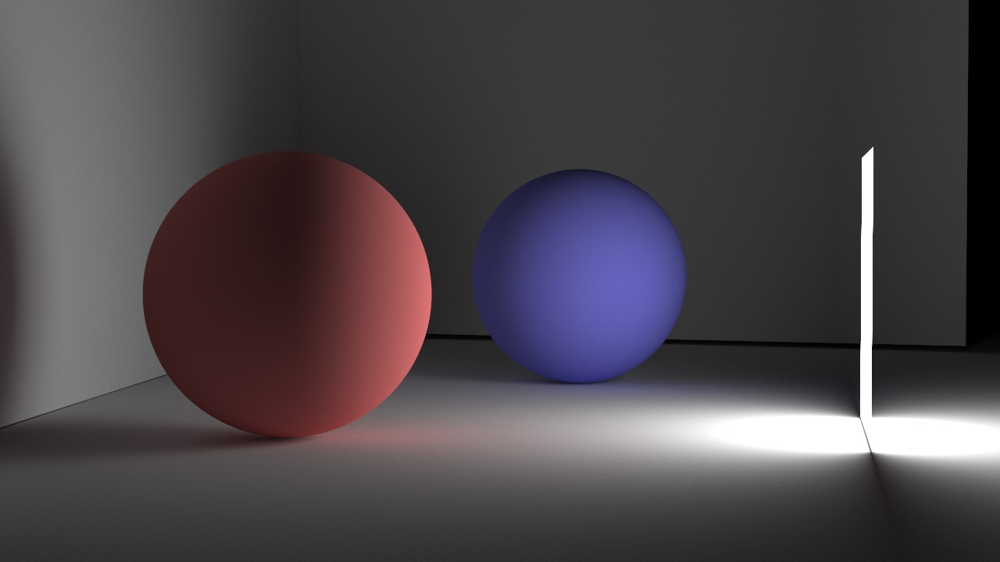

# Raytracer

- Path tracing
- BxDF
  - Lambertian diffuse reflectance
  - Specular reflection
  - Transparent
  - MERL BRDF
- Light
  - Diffuse light
  - Image based lighting (IBL)
- Texture
  - Checker pattern
  - Image
- Transient Rendering

## Cornell Box

## MERL BRDF

## Transient Imaging

[[YouTube]](https://youtu.be/Iu2iSUdv66A)
